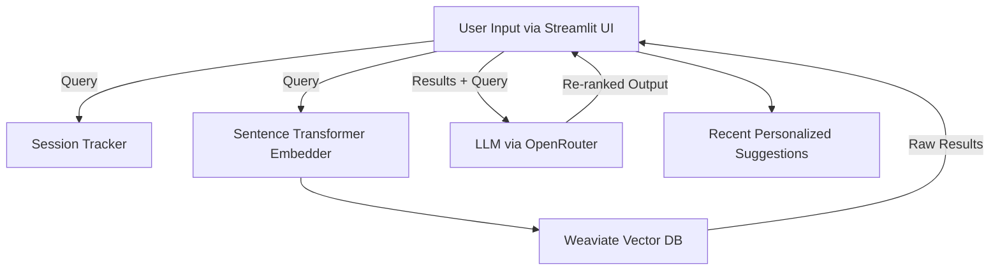

# 🛒 GroceryGPT+ — Personalized Grocery Search Engine with LLM Reranking

[](https://streamlit.io)
[](https://weaviate.io)
[](https://openrouter.ai)
[](https://opensource.org/licenses/MIT)

> **GroceryGPT+** is a multimodal-ready, LLM-powered grocery product search engine that delivers smart, personalized results using semantic search and Large Language Model (LLM) reranking.

---

## 🔧 Features

✅ **Semantic Text Search** using Sentence Transformers  
✅ **LLM-Powered Reranking** using Qwen/Mistral/DeepSeek (via OpenRouter)  
✅ **Model Fallback System** with latency tracking & cache  
✅ **Streamlit UI** for seamless interaction  
✅ **Personalized Suggestions** using session memory  
✅ **CLI for Schema Creation + Batch Ingestion**  
✅ **Production-ready structure** with modular components

---

## 🖼️ Architecture Overview


---

## 🧪 Example Flow

1. User enters: _"vegan cereal under 200 calories"_
2. MiniLM embeds query → searches Weaviate for top matches
3. LLM reranks results based on user intent
4. Final output shown with raw + reranked sections
5. Session saves the query → influences future recommendations

---

## 🚀 Getting Started

### 1. Clone & Setup

```bash
git clone https://github.com/yourusername/grocerygpt.git
cd grocerygpt
pip install -r requirements.txt
```

### 2. Create .env

```bash
OPENROUTER_API_KEY=your-api-key-here
```

### 3. Start Weaviate (Docker)

```bash
docker run -d -p 8080:8080 semitechnologies/weaviate:latest
```

### 4. Ingest Products (once)

```bash
python search_agent.py
```

### 5. Run the App

```bash
streamlit run main.py
```

---

## 📁 Project Structure

grocerygpt/
├── app/
│ ├── main.py # Streamlit UI
│ ├── llm_agent.py # LLM reranking logic
│ ├── llm_utils.py # Model ping, fallback, caching
│ ├── search_agent.py # Vector DB indexing & search
│ └── session_agent.py # Session-based personalization
├── data/
│ └── products_cleaned.csv # Product dataset
├── requirements.txt
└── README.md

---

## 🧪 Tech Stack

- **Frontend**: [Streamlit](https://streamlit.io/) for interactive UI
- **Vector DB**: [Weaviate](https://weaviate.io/) for semantic product search
- **Embeddings**: [Sentence Transformers](https://www.sbert.net/) for encoding text
- **LLM Reranking**: OpenRouter API with fallback support for:
  - Qwen 3.14B (Free)
  - Mistral 7B Instruct (Free)
  - DeepSeek Chat v3 (Free)
- **Caching**: File-based cache for selected model
- **Logging**: Latency & error reporting in console
- **Personalization**: Query history-based keyword memory

---

## 📝 License

This project is licensed under the **MIT License**. See the [LICENSE](LICENSE) file for more details.
