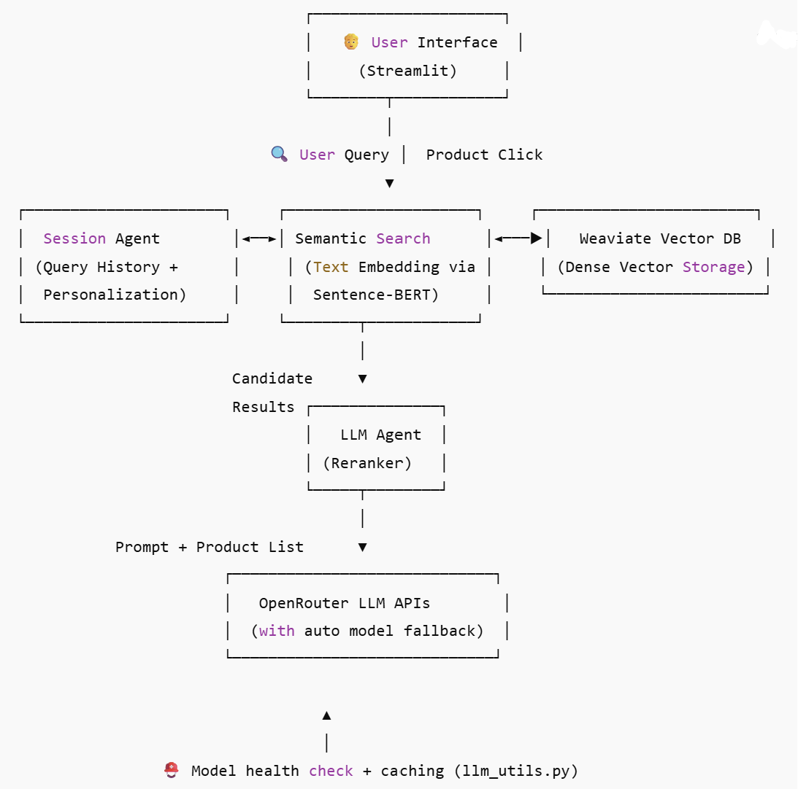
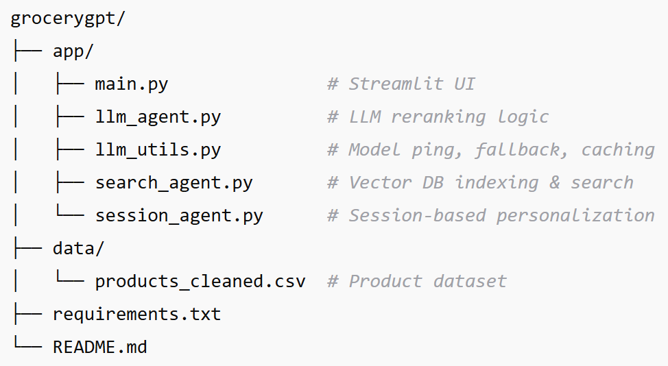

# 🛒 GroceryGPT+ — Personalized Grocery Search Engine with LLM Reranking

[](https://streamlit.io)
[](https://weaviate.io)
[](https://openrouter.ai)
[](https://opensource.org/licenses/MIT)
[](https://huggingface.co/spaces/rajesh1804/grocerygpt)

> 🚀 **GroceryGPT+** is a smart, real-time product search app combining **semantic vector search** with **LLM-powered reranking** and **personalized recommendations** — all production-ready.

---

## 🔧 Features

✅ **Semantic Text Search** using Sentence Transformers  
✅ **LLM-Powered Reranking** using Qwen/Mistral/DeepSeek (via OpenRouter)  
✅ **Model Fallback System** with latency tracking & cache  
✅ **Streamlit UI** for seamless interaction  
✅ **Personalized Suggestions** using session memory  
✅ **CLI for Schema Creation + Batch Ingestion**  
✅ **Production-ready structure** with modular components

---

## 🧠 How It Works — Under the Hood of GroceryGPT+

GroceryGPT+ isn't just another AI demo — it's a **modular, production-grade AI search system**. Here's how each part fits together to deliver accurate, real-time, and personalized product results.

### 🔍 1. Semantic Search with Vector Embeddings

User queries like _"vegan snacks under 150 calories"_ are first embedded using **`sentence-transformers`** (MiniLM). This allows semantic similarity — not just keyword matches — against product descriptions indexed in **Weaviate**, a powerful vector database.

> ✅ **Why it matters**: Enables natural language search — users can search like they think.

### 🧠 2. LLM-Powered Reranking for Relevance Boost

Top results from Weaviate are passed into an LLM (like **Qwen**, **Mistral**, or **DeepSeek**) via **OpenRouter API**. The LLM reranks products based on:
- Query intent  
- User context (session memory)  
- Hidden relevance signals  

It uses few-shot prompting with customizable templates to guide the LLM in sorting results.

> ✅ **Why it matters**: LLMs correct semantic drift, prioritize truly relevant results, and make results feel _smart_.

### 🧬 3. Personalization Engine via Session Memory

The app tracks previous queries and builds a **contextual keyword memory**, which influences:
- Query embeddings  
- Reranking prompts  
- Personalized recommendations  

This creates a **lightweight, stateless personalization layer** — no login required.

> ✅ **Why it matters**: Even short interactions feel personalized — like having a grocery-savvy assistant.

### ⚙️ 4. Efficient, Modular, and Cachable

- **Local cache** for embedding + LLM results to reduce latency  
- **Fallback logic** for LLMs — auto-retries with backup models  
- **CLI tooling** for ingestion & schema setup  
- Deploys on **Hugging Face Spaces** + **Weaviate Cloud** effortlessly

> ✅ **Why it matters**: Real-world robustness with fast, reliable UX

---

### 🧪 End-to-End Example Query Flow

1. User enters: _"vegan cereal under 200 calories"_
2. MiniLM (Sentence-Transformer ) embeds query to vector
3. Weaviate searches 768-dim vector space for top 5 matches
4. LLM (via OpenRouter) reranks the 5 results by intent-match
5. Final output shown with raw + reranked sections
6. Session saves the query → influences future recommendations

---

## 🖼️ Architecture Overview

<p align="center">
  
</p>

---


## 📽️ Live Demo

👉 Try it on [Hugging Face](https://huggingface.co/spaces/rajesh1804/grocerygpt)

<p align="center">
  
</p>

---

## 🚀 Getting Started

### 1. Clone & Setup

```bash
git clone https://github.com/rajesh1804/grocerygpt.git
cd grocerygpt
pip install -r requirements.txt
```

### 2. Create .env

```bash
OPENROUTER_API_KEY=your-api-key-here
```

### 3. Start Weaviate (Docker)

```bash
docker run -d -p 8080:8080 semitechnologies/weaviate:latest
```

### 4. Ingest Products (once)

```bash
python search_agent.py
```

### 5. Run the App

```bash
streamlit run main.py
```

---

## 📁 Project Structure

<p align="center">
  
</p>

---

## 🧪 Tech Stack

- **Frontend**: [Streamlit](https://streamlit.io/) for interactive UI
- **Vector DB**: [Weaviate](https://weaviate.io/) for semantic product search
- **Embeddings**: [Sentence Transformers](https://www.sbert.net/) for encoding text
- **LLM Reranking**: OpenRouter API with fallback support for:
  - Qwen 3.14B (Free)
  - Mistral 7B Instruct (Free)
  - DeepSeek Chat v3 (Free)
- **Caching**: File-based cache for selected model
- **Logging**: Latency & error reporting in console
- **Personalization**: Query history-based keyword memory

---

## 📝 License

This project is licensed under the **MIT License**. See the [LICENSE](LICENSE) file for more details.
